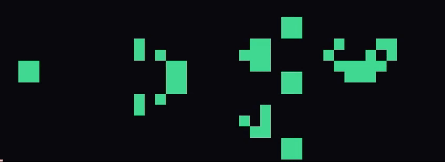

# game-of-life
An implementation of Conway's game of life in terminal using blessed graphics library.

## How it works? 
Game of life is a zero player game which has a grid consisting of cells which are either dead or alive. The game runs on the following 4 rules:
- Any live cell with fewer than two live neighbours dies, as if by underpopulation.  
- Any live cell with two or three live neighbours lives on to the next generation.  
- Any live cell with more than three live neighbours dies, as if by overpopulation.  
- Any dead cell with exactly three live neighbours becomes a live cell, as if by reproduction.
These four rules are used to calculate the next state using the previous state.
## Usage
```bash
git clone https://github.com/CjSidharth/game-of-life
cd game-of-life
pipenv sync
pipenv run python main.py
```
If you want to check patterns, you can enter path when prompted after selecting second option like patterns/x.txt where x is the name of the file. You can also create your own patterns by creating text files of 0 and 1s and see them come to life.  
Here's a famous pattern Gosper's Glider Gun:  


## TODO
- [ ] Stop flickering by directly drawing to screen instead of printing rapidly.
- [ ] Add support for patterns by click.
- [ ] Make a pseudo-infinite grid by wrapping around the edges.
- [ ] Extend to 3d and create this thing on Torus or a knot kinda like below.


